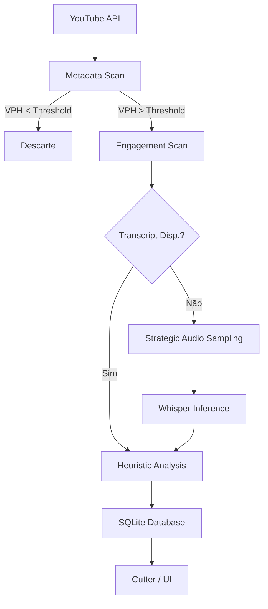

# Arquitetura do Sistema

## Visão Geral
O Viral Discovery Engine opera como um funil de filtragem progressiva, onde o custo computacional aumenta apenas para vídeos que demonstram alto potencial.

## Camadas de Processamento (The Funnel)

### Camada 1: Scanner de Baixa Latência (Metadata)
*   **Entrada:** YouTube API.
*   **Filtros:** VPH (Views Per Hour), Relative VPH, Momentum.
*   **Objetivo:** Eliminar 90% do ruído com custo zero de processamento local.

### Camada 2: Analisador de Engajamento (Signals)
*   **Entrada:** Comentários, Timestamps, Sentimento.
*   **Objetivo:** Detectar "pontos de calor" onde os humanos estão interagindo mais.

### Camada 3: Processamento de Conteúdo (Transcription)
*   **Tier A (API):** Transcrição via `youtube-transcript-api` (Custo zero).
*   **Tier B (Fallback):** `Strategic Audio Sampling` + `faster-whisper` (Custo GPU/CPU).
*   **Objetivo:** Obter o texto necessário para análise semântica sem baixar o vídeo completo.

### Camada 4: Heurística de Scoring
*   **Análise:** Clip Density, Authority Score, Hook Score.
*   **Resultado:** Ranking final no SQLite para consumo da UI ou automação de corte.

## Diagrama de Fluxo de Dados

## Estratégia de Scaling
*   **Workers:** Filas assíncronas para tarefas pesadas (Whisper/Download).
*   **Concurrency Limits:** Limite de 1 worker Whisper para evitar exaustão de VRAM/CPU.
*   **Cache:** Fingerprinting de áudio para evitar re-transcrição de conteúdo duplicado.
